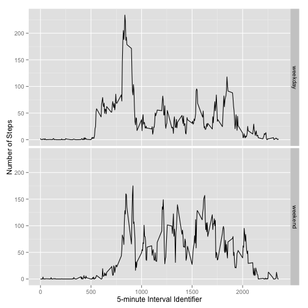

In this project, I analyzed the data from a personal activity monitoring device. This device collects data at 5 minute intervals through out the day. The data consists of two months of data from an anonymous individual collected during the months of October and November, 2012 and include the number of steps taken in 5 minute intervals each day.

## 1. Loading and preprocessing the data

The data is loaded using following codes. The format of the data is already easy for analysis, hence no transformation of the data is carried out.


```r
setwd("~/Downloads/cousera/jhu_data_science/5.reproducible_research/project")
data = read.csv("activity.csv")
head(data)
```

```
##   steps       date interval
## 1    NA 2012-10-01        0
## 2    NA 2012-10-01        5
## 3    NA 2012-10-01       10
## 4    NA 2012-10-01       15
## 5    NA 2012-10-01       20
## 6    NA 2012-10-01       25
```


## 2.  What is mean total number of steps taken per day?

Using the aggregate function to get the total number of steps taken per day and relabel the result.

```r
result = aggregate(data$steps ~ data$date, FUN=function(x) { sum = sum(x,na.rm=T)} )
names(result) = c("date","tot_steps")
```

Make a histogram of the total number of steps taken each day:

```r
hist(result$tot_steps, xlab="Total Number of Steps per Day", main="Histogram of Total Number of Steps per Day")
```

 

Calculate the mean and median total number of steps taken per day:

```r
mean(result$tot_steps)
```

```
## [1] 10766
```

```r
median(result$tot_steps)
```

```
## [1] 10765
```

## 3.  What is the average daily activity pattern?


Using the aggregate function to get the average number of steps taken for every 5-minute interval:

```r
result2 = aggregate(data$steps ~ data$interval, FUN=function(x) { mean = mean(x,na.rm=T)} )
names(result2) = c("interval","avg_steps")
```

Make a time series plot of the 5-minute interval (x-axis) and the average number of steps taken, averaged across all days (y-axis):


```r
plot(result2$interval, result2$avg_steps, type="l", xlab="5-minute Interval Identifier", ylab="Average Number of Steps", main="Average Daily Activity Pattern")
```

 

Which 5-minute interval, on average across all the days in the dataset, contains the maximum number of steps?

```r
# max
result2$interval[which.max(result2$avg_steps)]
```

```
## [1] 835
```

## 4. Imputing missing values 

Calculate and report the total number of missing values in the dataset:

```r
nrow(data)-sum(complete.cases(data))
```

```
## [1] 2304
```

Devise a strategy for filling in all of the missing values in the dataset. The strategy I used is to fill in the mean for that 5-minute interval. Create a new dataset, called "data2", that is equal to the original dataset but with the missing data filled in.

```r
data2 = data
data2$steps[!complete.cases(data2)]= result2$avg_steps
```

Make a histogram of the total number of steps taken each day and Calculate and report the mean and median total number of steps taken per day. 

```r
result3 = aggregate(data2$steps ~ data2$date, FUN=function(x) { sum = sum(x,na.rm=T)} )
names(result3) = c("date","tot_steps")
hist(result3$tot_steps, xlab="Total Number of Steps per Day", main="Histogram of Total Number of Steps per Day")
```

 

Mean and median of total number of steps taken per day:

```r
mean(result3$tot_steps)
```

```
## [1] 10766
```

```r
median(result3$tot_steps)
```

```
## [1] 10766
```

The values only differ a little from the estimates from the first part of the assignment. Since I filled in the averge value for number of steps taken at certain interval, imputing missing data only have very small  impact  on the estimates of the total daily number of steps.

## 5. Are there differences in activity patterns between weekdays and weekends?

Create a new factor variable in the dataset with two levels – “weekday” and “weekend” indicating whether a given date is a weekday or weekend day.

```r
day_type=c()
# get day_type for each row in data
for(i in 1:nrow(data)){
  wd = weekdays(as.Date(data$date[i]))
  if(wd =="Sunday" | wd =="Saturday") day_type=c(day_type,"weekend")
  else day_type=c(day_type,"weekday")
}
# combine day_type column 
data3 = cbind(data,day_type)
```

Make a panel plot containing a time series plot of the 5-minute interval (x-axis) and the average number of steps taken, averaged across all weekday days or weekend days (y-axis). 


```r
# aggregate to get result
result4 = aggregate(steps~interval+day_type,data=data3,FUN=function(x){mean=mean(x,na.rm=T)})
# plot
library(ggplot2)
qplot(interval,steps,data=result4,facets=day_type~.,geom="line", xlab="5-minute Interval Identifier", ylab="Number of Steps")
```

 
